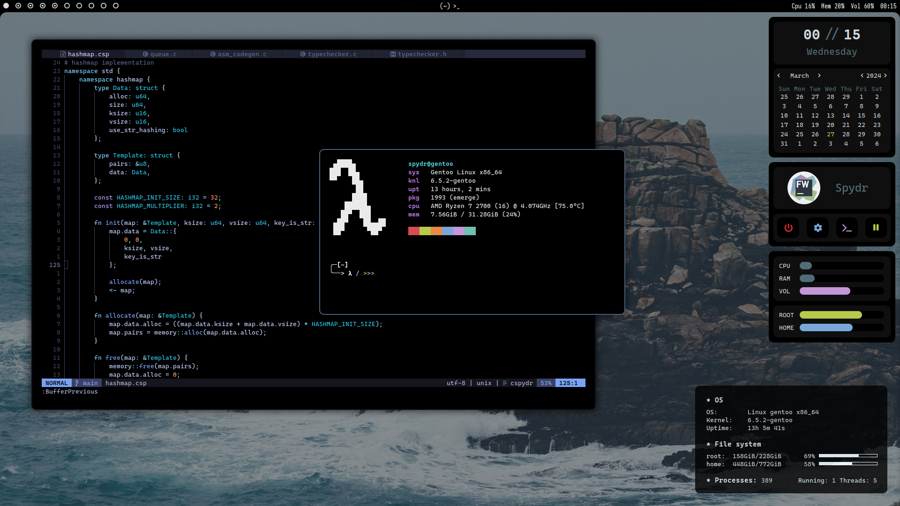

<div align="center">
    <p>
        </img>
    </p>
    <h2>Configuration files of my linux system.</h2>
</div>



> **Note**
> For older setups, please visit the [release tab](https://github.com/spydr06/dotfiles/releases)

## Contents

Configurations:

* [alacritty](../.config/alacritty)
* [polybar](../.config/polybar)
* [bspwm](../.config/bspwm)
* [sxhkd](../.config/sxhkd)
* [picom](../.config/picom)
* [starship](../.config/starship.toml)
* [tabliss](../tabliss.json)
* [zsh](../.zshrc)
* [eww](../.config/eww)
* [conky](../.config/conky.conf)
* [neovim](../.config/nvim)
* [vscodium](../config/VSCodium)

Suckless forks:

* [dwm](../suckless/dwm)
* [tabbed](../suckless/tabbed)

## Installation

This repository is set up like your `$HOME` folder.

### 1) Clone this repository

```bash
$ git clone --recursive https://github.com/spydr06/dotfiles.git spydr06-dotfiles
$ cd spydr06-dotfiles
```

### 2) Copy configurations

When cloned, copy all configuration files you want from the repository to your `$HOME` folder. Make sure to copy them into the exact same folder as in this repo.

> **Note**
> I do not provide any kind of warranty or technical support. Do all of this at your own risk and make backups of your data before modifying your system.

## Keybinds

### sxhkd:

| Key                | Action |
|--------------------|--------|
| `super` + `return` | `tabbed alacritty --embed` |
| `super` + `b`      | `firefox`                  |
| `super` + `e`      | `codium`                   |
| `super` + `d`      | `~/.config/rofi/launcher.sh` |
| `super` + `p`      | `light-locker-command -l`
| `super` + `s`      | screenshot selection |
| `super` + `shift` + `s` | screenshot whole screen |
| `super` + `escape` | restart `sxhkd` |
| `super` + `shift` + `e` | exit `bspwm` |
| `super` + `shift` + `r` | restart `bspwm` |
| `super` + `m`      | toggle between tiled and monocle layout |
| `super` + `y`      | send marked window to preselection |
| `super` + `t`      | set window tiled |
| `super` + `shift` + `t` | set window pseudo-tiled |
| `super` + `x`      | set window floating |
| `super` + `f`      | set window fullscreen |
| `super` + {`m`, `x`, `y`, `z`} | set window flags (`marked`, `locked`, `sticky`, `private`) |
| `super` + arrow keys | move selection |
| `super` + `shift` + arrow keys | move window |
| `super` + `alt` + arrow keys | resize window |
| `super` + `space` | select next window in workspace |
| `super` + `shift` + `space` | select previous window in workspace |
| `super` + `[` | switch to previous workspace |
| `super` + `]` | switch to next workspace |
| `super` + `tab` | switch between last two windows |
| `super` + {`1` ... `9`, `0`} | switch to workspace `1`, ..., `9`, `10` |
| `super` + shift + {`1` ... `9`, `0`} | move window to workspace `1`, ..., `9`, `10` |
| `super` + `ctrl` + {`h`, `j`, `k`, `l`} | preselect in direction |
| `super` + `ctrl` + {`1`...`9`} | preselect ratio |
| `super` + `ctrl` + `space` | cancel preselection |
| `super` + `ctrl` + `shift` + `space` | cancel preselection on current workspace |

> **Note**
> See [sxhkdrc](../.config/sxhkd/sxhkdrc)

### alacritty:

| Key           | Action |
|---------------|--------|
| `ctrl` + `shift` + {`c`, `v`} | copy/paste
| `ctrl` + {`+`, `-`} | increase/decrease font size

> **Note**
> See [alacritty.yml](../.config/alacritty/alacritty.yml)

### tabbed:

| Key           | Action |
|---------------|--------|
| `ctrl` + `shift` + `enter` | add new instance |
| `ctrl` + {`1` ... `9` } | switch to tab |
| `ctrl` + `tab` | switch between current and previous tap |

### vscodium:

> **Note**
> See [keybindings.json](../.config/VSCodium/User/keybindings.json)
